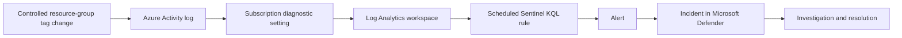

# Azure Activity Monitoring and Incident Investigation with Microsoft Sentinel

I recently passed AZ-900, and I wanted to put what I learned into
practice. Since I'm interested in cybersecurity analyst roles,
I'm building this lab to learn how to collect security logs,
write detections, and investigate activity in Azure.

## What I'm planning to build

- A small Azure environment with dummy files and test permissions.
- Log collection and monitoring with Microsoft Sentinel.
- Detections for permission and storage configuration changes.
- Investigation reports showing what happened, how I checked it,
  and how I verified the fix.

## Current progress

- [x] Verified my Azure student offer and confirmed the available credit.
- [x] Created this repository.
- [ ] Plan the environment and review costs.
- [ ] Set up Azure resources and collect activity logs.
- [ ] Write and test detections.
- [ ] Document investigations and remediation.

## About this project

This is a personal learning lab, not a production environment.
I'll use my own resources and dummy data, and document the setup,
results, and troubleshooting as I go.

# Azure Activity Monitoring and Incident Investigation with Microsoft Sentinel

I built this lab to practice collecting Azure Activity logs,
investigating resource changes with KQL, and following a
Microsoft Sentinel alert through investigation and resolution.

I used controlled resource-group tag changes to test the
workflow. These were expected lab actions, not simulated attacks.

## Scope and outcome

I completed the following workflow:

1. Configured an Azure lab resource group and Log Analytics workspace.
2. Enabled Microsoft Sentinel and configured Azure Activity log export.
3. Verified the managed identity responsible for the logging setup.
4. Generated controlled tag changes and located their Activity log records.
5. Created and tested a scheduled detection rule.
6. Investigated repeated alerts and measured ingestion delay.
7. Added source IP and Azure resource entity mappings.
8. Investigated and resolved the resulting incidents.

The final controlled test produced one observed alert.
This is a small lab validation, not a production readiness claim.

## Architecture

Azure Policy and its managed identity configured the subscription
diagnostic setting that sends Activity logs to the workspace.

## Environment

| Component | Lab configuration |
|---|---|
| Subscription | Azure for Students |
| Resource group | `rg-azure-security-lab` |
| Log Analytics workspace | `law-azure-security-lab` |
| Workspace region | Sweden Central |
| Log table | `AzureActivity` |
| Detection interface | Microsoft Sentinel in the Defender portal |
| Test operation | `MICROSOFT.RESOURCES/TAGS/WRITE` |
| Test tag | `LabTest` |

## Setup outline

To reproduce this lab in another subscription:

1. Create a dedicated resource group and Log Analytics workspace.
2. Configure budget notifications and review workspace retention and ingestion settings.
3. Enable Microsoft Sentinel on the workspace.
4. Install the Azure Activity solution and configure its connector.
5. Assign the policy that streams Azure Activity logs to the workspace.
6. Configure its managed identity and required permissions, and remediate existing resources where needed.
7. Verify that `AzureActivity` contains subscription events.
8. Create the scheduled rule using the settings below.
9. Change a tag on the lab resource group once, record its time, and trace its correlation ID.
10. Compare the source event, alert, and incident before classifying and resolving the test.

Replace the resource-group name in the queries when using a
different environment. Installing a solution alone does not
prove that its logs are connected; verify actual records.

My detailed setup history and screenshots are in the
[lab journal](docs/lab-journal.md) and [screenshots folder](screenshots/).

## Detection rule

**Name:** LAB - Successful tag change on lab resource group

| Setting | Value |
|---|---|
| Severity | Informational |
| Frequency | Every 5 minutes |
| Event lookback | 15 minutes |
| Threshold | More than 0 results |
| Event grouping | Group results into one alert per run |
| Incident creation | Enabled |
| Alert grouping | Alerts from this rule within 1 hour |
| Reopen closed incidents | Disabled |
| Automated response | None configured |

The query is saved in
[successful-tag-writes.kql](queries/successful-tag-writes.kql).

It selects successful tag writes and limits ingestion time
to the interval after five minutes before the query reference
time, through that reference time.

Entity mappings:

| Entity | Identifier | Query field |
|---|---|---|
| IP | Address | `CallerIpAddress` |
| Azure resource | ResourceId | `_ResourceId` |

These mappings displayed the source IP and resource group
in the incident graph.

## Investigation and tuning

The initial test produced three alerts referring to the same
source event. I compared timestamps, correlation IDs, callers,
operations, and resource IDs.

I first added only `ingestion_time() > ago(5m)`.
The next controlled test still produced two alerts.

Their query reference times were 01:40:39 and 01:45:39 UTC.
The successful event had an ingestion timestamp of approximately
01:41:01 UTC. A lower bound alone did not exclude an ingestion
timestamp later than the earlier query reference time.

I added `ingestion_time() <= now()` to bound the other end
of the window, then performed a fourth controlled test.

### Final test timeline

Times below are September 30, 2026, in New York (EDT).

| Time | Observation |
|---|---|
| 22:05:28 | Successful fourth tag write |
| 22:13:46 | Successful event ingested into Log Analytics |
| 22:15:04 | Alert query reference time, converted from UTC |
| 22:28 | Incident contained two earlier-test alerts and one fourth-test alert |
| Approximately 22:34 | Incident 2 resolved as Benign Positive |

The fourth test's correlation ID was
`932c7419-ac40-456e-8797-0de4173d01fd`.

Its ingestion delay was approximately 8 minutes 18 seconds.
The preceding test had a delay of approximately 9 minutes
28 seconds.

The fourth test produced one observed alert during the
observation period. Additional testing would be needed to
assess behavior under retries, scheduler interruptions,
larger volumes, or different ingestion delays.

## Selected evidence

- [Third-test ingestion delay](screenshots/33-tag-event-ingestion-delay.png)
- [Incident with mapped entities](screenshots/34-updated-rule-test-incident.png)
- [Repeated alerts during observation](screenshots/36-alert-count-after-observation.png)
- [Fourth-test event and ingestion times](screenshots/41-fourth-test-event-ingestion.png)
- [Fourth-test alert source record](screenshots/42-fourth-test-alert-evidence.png)
- [Final observed alert count](screenshots/43-fourth-test-alert-count.png)
- [Resolved incident](screenshots/44-second-incident-resolved.png)

## Reusable queries

- [Investigate recent lab activity](queries/activity-log-investigation.kql)
- [Scheduled successful-tag-write detection](queries/successful-tag-writes.kql)
- [Measure ingestion delay](queries/ingestion-delay-check.kql)

## Limitations

- Tag changes alone do not indicate malicious behavior.
- This rule covers one operation in one resource group.
- The fifteen-minute event lookback can miss sufficiently delayed events.
- Ingestion time is approximate and differs from event time.
- Incident grouping does not eliminate duplicate alerts.
- One successful controlled test does not guarantee exactly-once detection.
- The lab does not include automated remediation or broad Azure threat coverage.

## Cost controls and cleanup

I used Azure for Students and configured a budget, a workspace
daily cap of 0.100 GB, and 30-day retention.

Budget notifications and the daily cap should not be treated
as a guaranteed total spending limit. Review actual usage,
applicable charges, and trial status in the portal.
Closing the browser does not remove cloud resources.

When retiring the lab:

1. Export any queries, rule configuration, and evidence to keep.
2. Disable the practice analytics rule.
3. Remove the lab policy assignment and its diagnostic export setting.
4. Review and remove role assignments created specifically for the lab identity.
5. Delete the dedicated lab resource group after confirming its contents.
6. Check for remaining subscription-level configuration and review costs.

Cleanup has not been performed as part of the documented tests.
Deleting the resource group alone does not remove every
subscription-level configuration.

## What I learned

I practiced distinguishing event time, ingestion time, query
reference time, and incident creation time.

I learned to follow correlation IDs, verify an application's
managed identity, investigate repeated alerts, and document
unexpected results instead of assuming a rule worked.

I used ChatGPT/Codex to help write and explain KQL and troubleshoot
the lab. I ran the tests, inspected the evidence, and made the
Azure configuration changes myself.
